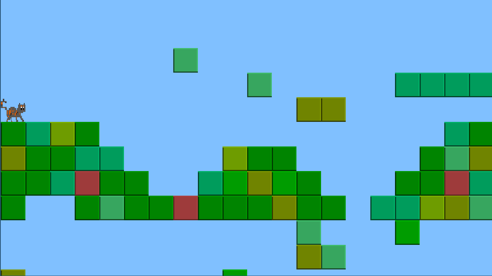

## Nutmeg's Adventure! 
This is Nutmeg's adventure, a platforming game with the following dependencies:

##### Development enviromnment
* Written in the C++ Programming language
* configured Vim as an IDE
* SDL2 Gaming Library

> Video link: <https://youtu.be/mV6DQF-jCCM>

The purpose of this project was to familiarize myself with the basics of C++ object oriented programming, as well as cusom-sprite editing.  
The map for this level is loaded from a .dat file, and numbered in order to be interpreted by the program to load the proper sprite png.

All the physics are provided in 'Entities' file. The kitten is constrained to move according to the boundaries defined by the TILESIZE and its own pixel size. If we were convert the png to be larger, we would easily see poor Nutmeg fail to fit in her enviroment (too much milk!).

I hope to use this as an benchmark as a first attempt to learn this language. Have fun playing!

##### Useful websites  
<https://wiki.libsdl.org/>
<http://lazyfoo.net/tutorials/SDL/index.php>

##### Future Work  
Things to improve (TODO):
* Walking animation  
* A menu to navigate  
* Coin collection
